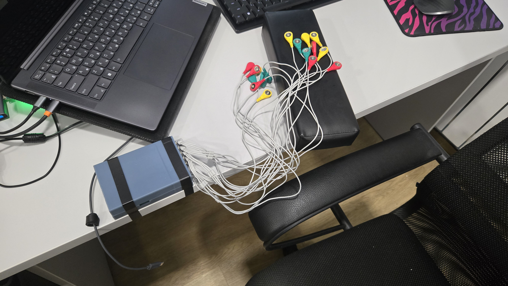

# Emg capture hardware

## Steps to solder

1. Get up to 6 `Bioelectronic Circuit EMG` signal amplifiers

2. Make a power supply for amplifiers
    - Get a `MEAN WELL GST25E18-P1J` 18v power supply 
    
    - Solder a `18v` - `+-9v` adapter 
    
3. Flash `Seeduino XIAO nrf52` with [adc sampler](xiao_adc_sampler/src/main.c) and connect sEMG amplifiers to A0-A6 of the board

4. 3D print the [box](3d/box.plasticity) and put all the components altogether

5. Optionally get a USB isolator like `BM8050usb`

